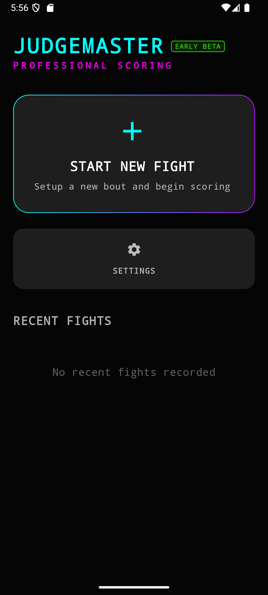
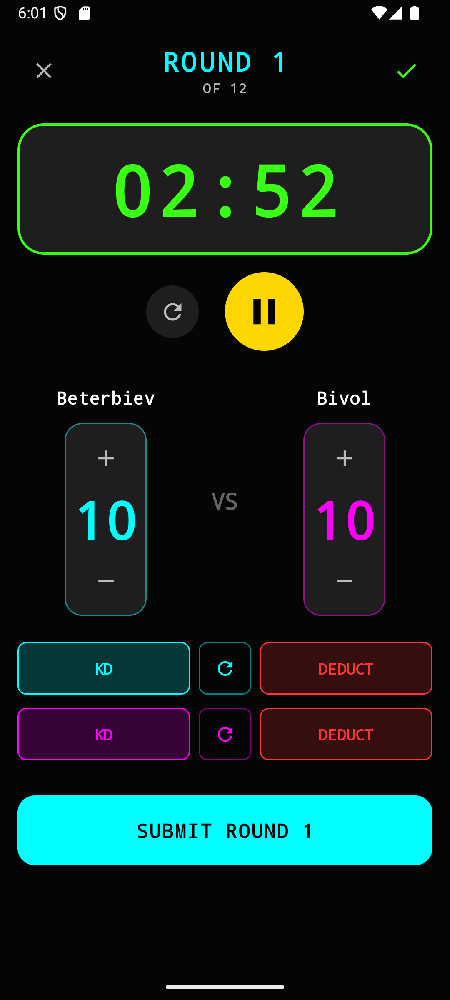

  
  <h1>Judgemaster</h1>
  
<em>A lightweight Android app for scoring boxing matches</em>

## About

Judgemaster is a free tool for scoring boxing matches on your Android device. It replaces pen and paper with a simple digital scorecard that lets you log rounds, track scores, and save your fight history.

## Features

- **10-Point Must System** – Standard boxing scoring
- **Customizable Fights** – Set number of rounds, round duration, and weight classes for both corners
- **Fight History** – Automatically saves your scorecards for easy review
- **Export Cards** – Share your scorecards with others
- **Dark & Light Themes** – Choose between neon dark mode or light mode
- **No Bloat** – No ads, no unnecessary features—just the scorecard

## Screenshots

  
  

## Installation

> **Note:** Judgemaster is currently in Early Beta.

1. Download the latest APK from the [Releases](../../releases) page
2. Install it on your Android device
3. Open the app and tap **Start New Fight**

## Feedback

This is a beta release, so things may change as development continues. If you encounter bugs or have suggestions for improving the scorecard layout, please [open an issue](../../issues).

## License

[Add your license here if applicable]
